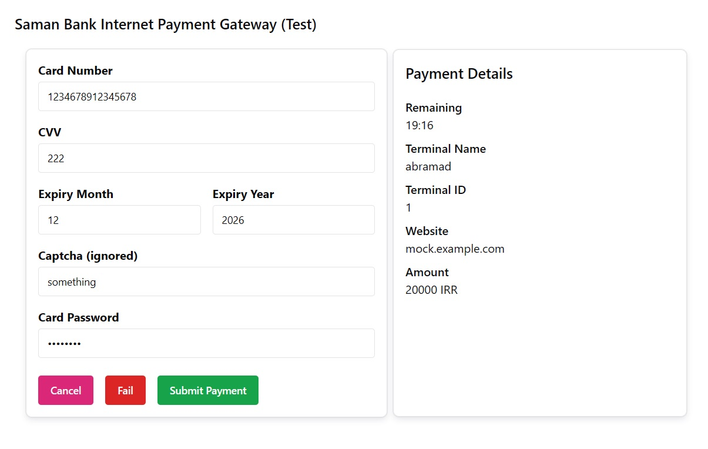

# IR Bank Mock

A service for testing the internet payment gateways of Iranian banks for development environments.

سرویسی برای تست درگاه پرداخت اینترنتی بانک های ایرانی در محیط‌های توسعه



## Support

This service currently only supports Saman Bank (SEP).

## Configuration

Visit [conf.go](./internal/conf/conf.go) to see which environment variables are supported.

## Deploy with Docker

```sh
docker run -v "irbankmock-data:/opt/irbankmock/data" --rm -p 13000:3000 ghcr.io/abramad-labs/irbankmock:0.0.9-r1
```

### Deploy with Compose

Download `docker-compose.yml` from this repository and then execute:

```
docker compose up -d
```

## Security Considerations

This is a lightweight service used for testing purposes only. This is why there is no authentication or 
banking security protocols invloved. Do not expose this service into to the wilderness.

## Sqlite Notice

We decided to use `github.com/glebarez/sqlite` instead of `gorm.io/driver/sqlite`. The trade-off 
was to lose a little bit of performance to gain a `cgo`-free package. 
This also enabled us to use `distroless/static` instead of `distroless/base`.

Read more:

- [cgo is not go](https://dave.cheney.net/2016/01/18/cgo-is-not-go)
- [SQLite in Go, with and without cgo](https://datastation.multiprocess.io/blog/2022-05-12-sqlite-in-go-with-and-without-cgo.html)


## Debugging

1. Run go server with `go run .\cmd\server\main.go`
2. Go to webapp directory and run the dev server: `cd .\web\app` and `bun run dev`

## Specification

### Saman Electronic Payment (SEP)

- Implemented based on [SEP_OnlinePG_Merchant Document_Minimal_Current.pdf](./docs/SEP_OnlinePG_Merchant%20Document_Minimal_Current.pdf)

- It's a terrible documentation, I know...
